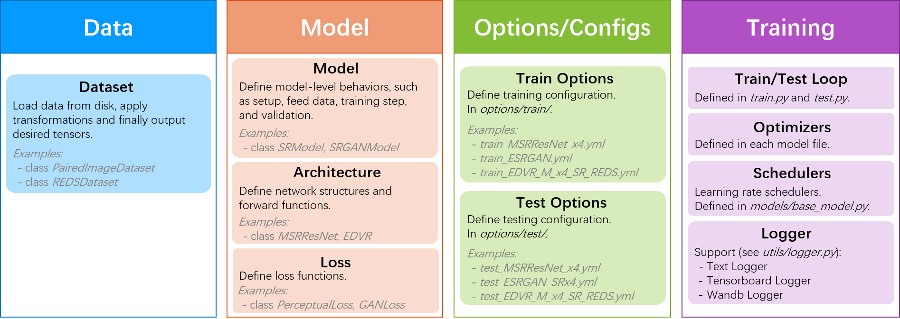

# Codebase Designs and Conventions

[English](DesignConvention.md) **|** [简体中文](DesignConvention_CN.md)

#### Contents

1. [Overall Framework](#Overall-Framework)
1. [Features](#Features)
    1. [Dynamic Instantiation](#Dynamic-Instantiation)
1. [Conventions](#Conventions)

## Overall Framework

The `BasicSR` framework can be divided into the following parts: data, model, options/configs and training process. <br>
When we modify or add a new method, we often modify/add it from the above aspects. <br>
The figure below shows the overall framework.



## Features

### Dynamic Instantiation

When we add a new class or function, it can be used directly in the configuration file. The program will automatically scan, find and instantiate according to the class name or function name in the configuration file. This process is called dynamic instantiation.

Specifically, we implement it through `importlib` and `getattr`. Taking the data module as example, we follow the below steps in [`data/__init__.py`](../basicsr/data/__init__.py):

1. Scan all the files under the data folder with '_dataset' in file names
1. Import the classes or functions in these files through `importlib`
1. Instantiate through `getattr` according to the name in the configuration file

```python
# automatically scan and import dataset modules
# scan all the files under the data folder with '_dataset' in file names
data_folder = osp.dirname(osp.abspath(__file__))
dataset_filenames = [
    osp.splitext(osp.basename(v))[0] for v in mmcv.scandir(data_folder)
    if v.endswith('_dataset.py')
]
# import all the dataset modules
_dataset_modules = [
    importlib.import_module(f'basicsr.data.{file_name}')
    for file_name in dataset_filenames
]

...

# dynamic instantiation
for module in _dataset_modules:
    dataset_cls = getattr(module, dataset_type, None)
    if dataset_cls is not None:
        break
```
We use the similar techniques for the following modules. Pay attention to the conventions of file suffix when using them:

| Module         | File Suffix     | Example        |
| :------------- | :----------:    | :----------:   |
| Data           | `_dataset.py`   | `data/paired_image_dataset.py` |
| Model          | `_model.py`     | `basicsr/models/sr_model.py` |
| Archs          | `_arch.py`      | `basicsr/models/archs/srresnet_arch.py`|

Note:

1. The above file suffixes are only used when necessary. Other file names should avoid using the above suffixes.
1. Note that the class name or function name cannot be repeated.

In addition, we also use `importlib` and `getattr` for `losses` and `metrics`. However, for losses and metrics, the number of files is smaller and the changes are less. So, we do not use the strategy of scanning files.
For these two modules, after adding new classes or functions, we need to add the corresponding class or function names to `__init__.py`.

| Module         | Path     | Modify `__init__.py`        |
| :------------- | :----------:    | :----------:   |
| Losses           | `basicsr/models/losses`   | [`basicsr/models/losses/__init__.py`](../basicsr/models/losses/__init__.py) |
| Metrics          | `basicsr/metrics`     | [`basicsr/metrics/__init__.py`](../basicsr/metrics/__init__.py)|

## Conventions

1. In dynamic instantiation, there are requirements to the file suffix in the following module. Otherwise, automatic instantiation cannot be achieved.

    | Module         | File Suffix     | Example        |
    | :------------- | :----------:    | :----------:   |
    | Data           | `_dataset.py`   | `data/paired_image_dataset.py` |
    | Model          | `_model.py`     | `basicsr/models/sr_model.py` |
    | Archs          | `_arch.py`      | `basicsr/models/archs/srresnet_arch.py`|

1. When logging, the loss items are recommended to start with `l_`, so that all these loss items will be grouped together in tensorboard. For example, in [basicsr/models/srgan_model.py](../basicsr/models/srgan_model.py), we use `l_g_pix`, `l_g_percep`, `l_g_gan`, etc for loss items. In [basicsr/utils/logger.py](../basicsr/utils/logger.py), these items will be grouped together:

    ```python
    if k.startswith('l_'):
        self.tb_logger.add_scalar(f'losses/{k}', v, current_iter)
    else:
        self.tb_logger.add_scalar(k, v, current_iter)
    ```
