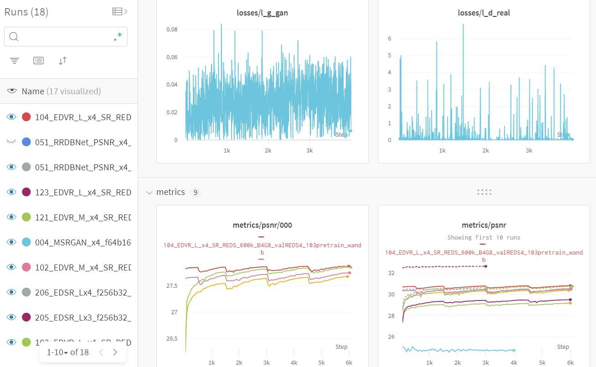

# Put pre-trained models here

**[Download official pre-trained models](https://drive.google.com/drive/folders/15DgDtfaLASQ3iAPJEVHQF49g9msexECG?usp=sharing)**

You can use the scrip to download pre-trained models from Google Drive.

```python
python scripts/download_pretrained_models.py
```

**[Download reproduced models and logs](https://drive.google.com/drive/folders/1XN4WXKJ53KQ0Cu0Yv-uCt8DZWq6uufaP?usp=sharing)**

In addition, we upload the training process and curves in [wandb](https://www.wandb.com/).

**[Training curves in wandb](https://app.wandb.ai/xintao/basicsr)**

<p align="center">
<a href="https://app.wandb.ai/xintao/basicsr" target="_blank">
   
</a></p>

---

**[下载官方提供的预训练模型](https://drive.google.com/drive/folders/15DgDtfaLASQ3iAPJEVHQF49g9msexECG?usp=sharing)**

你可以使用以下脚本从Google Drive下载预训练模型.

```python
python scripts/download_pretrained_models.py
```

**[下载复现的模型和log](https://drive.google.com/drive/folders/1XN4WXKJ53KQ0Cu0Yv-uCt8DZWq6uufaP?usp=sharing)**

此外, 我们在 [wandb](https://www.wandb.com/) 上更新了模型训练的过程和曲线. 大家可以方便的比较:

**[wandb训练曲线](https://app.wandb.ai/xintao/basicsr)**
