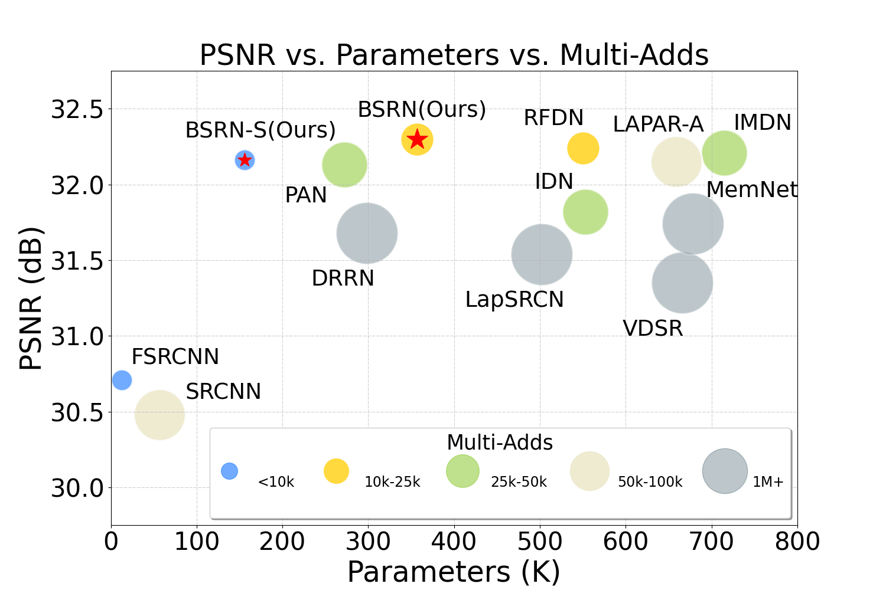

# Plot Figures

We provide source codes for some representative figures.
You can easily modify those figures to fit your needs.

The commonly used functions are defined in [basicsr/utils/plot_util.py](https://github.com/XPixelGroup/BasicSR/blob/plot/basicsr/utils/plot_util.py), such as `read_data_from_tensorboard`, `smooth_data`, `read_data_from_txt_2v`, *etc*.

- [model_complexity_cmp_bsrn.py](model_complexity_cmp_bsrn.py) by Haoming Cai. [[Paper](https://openaccess.thecvf.com/content/CVPR2022W/NTIRE/papers/Li_Blueprint_Separable_Residual_Network_for_Efficient_Image_Super-Resolution_CVPRW_2022_paper.pdf)]

  

